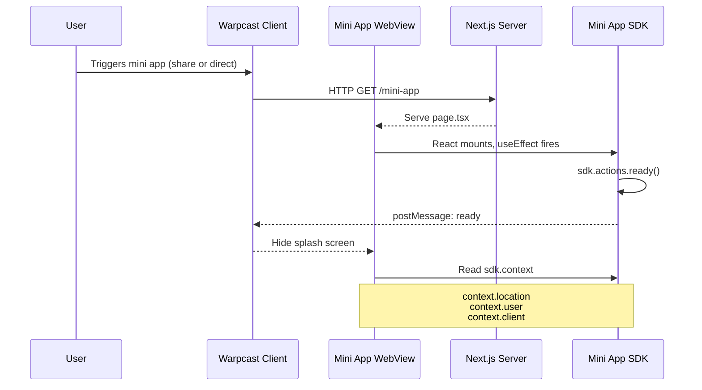
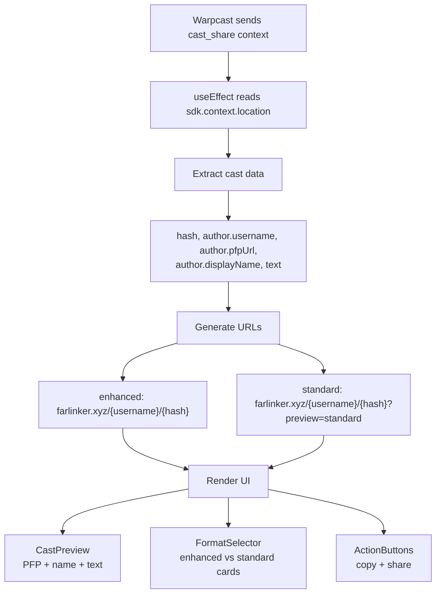
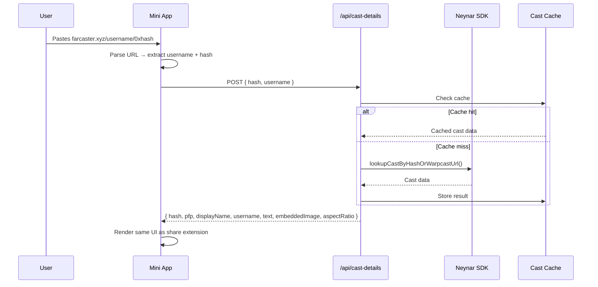
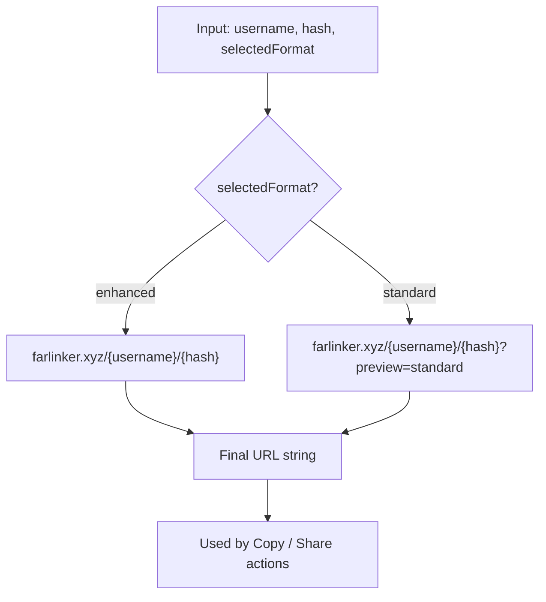
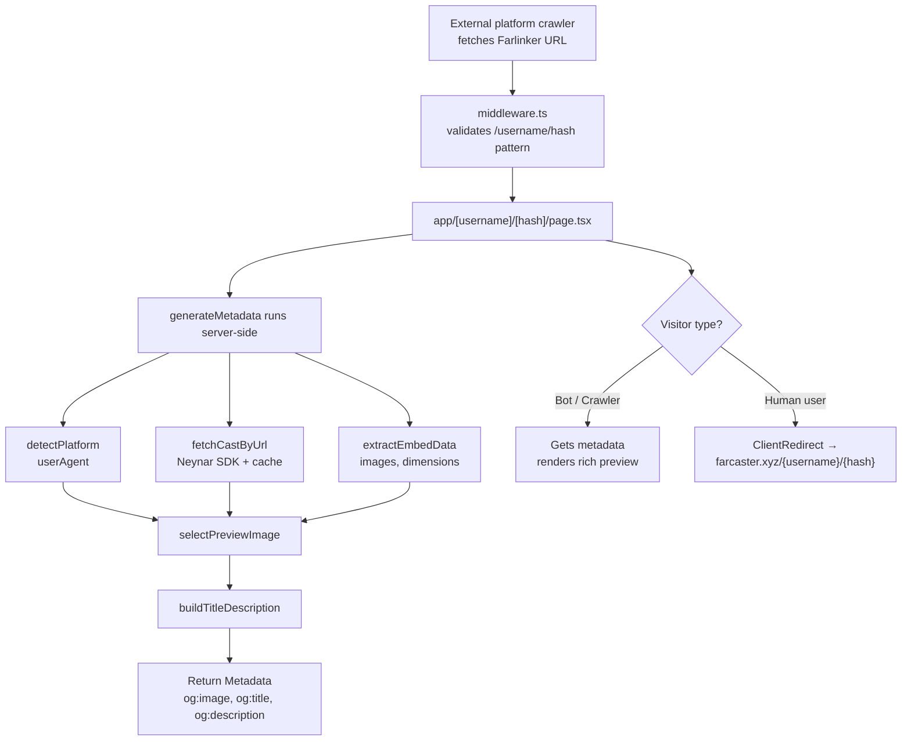
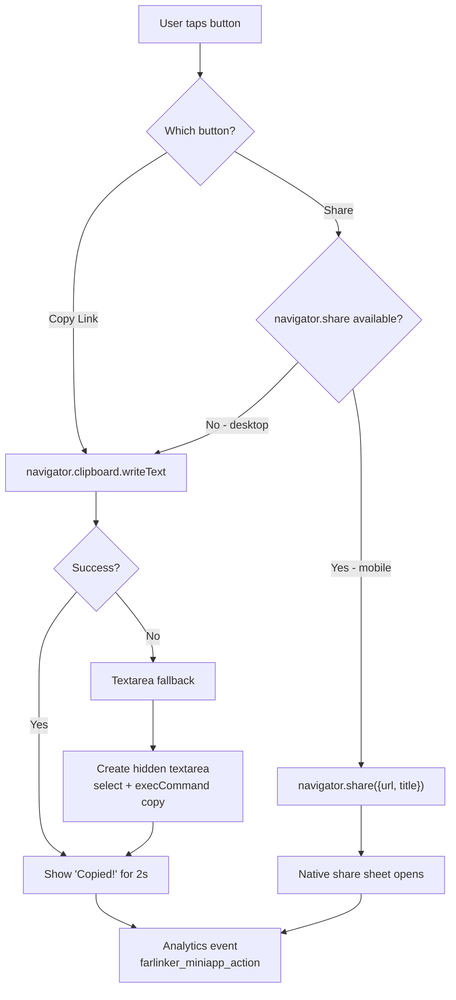
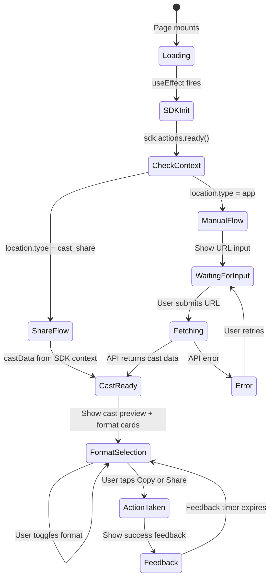

# Mini App Process & Data Flows

## Overview

This document describes the technical process and data flows for the Farlinker Mini App — how data moves from Farcaster through the SDK, into the app, and out to the user.

---

## 1. SDK Initialization Sequence



### Context Object Shape

```typescript
// Available after SDK init
sdk.context = {
  user: {
    fid: number,
    username: string,
    displayName: string,
    pfpUrl: string,
  },
  location: {
    // Share extension entry
    type: 'cast_share',
    cast: {
      hash: string,
      author: { fid, username, displayName, pfpUrl },
      text: string,
      timestamp: string,
      channelKey?: string,
    }
  } | {
    // Direct launch entry
    type: 'app',
  },
  client: {
    platformType: 'web' | 'mobile',
    clientFid: number,
    added: boolean,
    safeAreaInsets: { top, bottom, left, right },
  }
}
```

---

## 2. Cast Data Flow — Share Extension

When a user shares a cast to Farlinker, the data flows entirely through the SDK context. No API call is needed.



### Data Dependencies

| Component | Data Required | Source |
|-----------|--------------|--------|
| CastPreview | author PFP, display name, text | `sdk.context.location.cast` |
| FormatSelector | generated URLs, example images | Computed from cast hash + username |
| ActionButtons | selected URL | State from FormatSelector |

---

## 3. Cast Data Flow — Direct Launch (Manual URL)

When no cast context is available, the user provides a URL and we fetch cast data via API.



---

## 4. URL Generation Logic



### What Happens When the Generated URL is Opened



---

## 5. Share / Copy Action Flow



---

## 6. State Management

The mini app uses React state only — no external state library needed given the simplicity.



### Component State Tree

```
MiniAppPage (root)
│
├── isLoaded: boolean          — SDK initialized?
├── castData: Cast | null      — from SDK context or API
├── entrySource: 'cast_share' | 'manual'
│
├── FormatSelector
│   └── selectedFormat: 'enhanced' | 'standard'
│
├── URLDisplay
│   └── generatedUrl: string   — derived from castData + selectedFormat
│
└── ActionButtons
    └── copyFeedback: boolean  — shows "Copied!" temporarily
```

---

## 7. API Endpoints Used by Mini App

| Endpoint | Method | Used When | Request | Response |
|----------|--------|-----------|---------|----------|
| `/api/cast-details` | POST | Manual URL entry (no SDK context) | `{ hash, username? }` | `{ hash, pfp, displayName, username, text, embeddedImage, aspectRatio }` |

The share extension flow does **not** call any API — all cast data comes from the SDK context.

---

## 8. Manifest Configuration

```json
// public/.well-known/farcaster.json
{
  "accountAssociation": { ... },
  "miniapp": {
    "version": "1",
    "name": "Farlinker",
    "iconUrl": "https://farlinker.xyz/farlinker.png",
    "splashImageUrl": "https://farlinker.xyz/farlinker.png",
    "splashBackgroundColor": "#8B5CF6",
    "homeUrl": "https://farlinker.xyz/mini-app",
    "castShareUrl": "https://farlinker.xyz/mini-app/share"
  },
  "actions": [ ... ]
}
```

| Field | Purpose |
|-------|---------|
| `homeUrl` | Entry point when user launches app directly |
| `castShareUrl` | Entry point when user shares a cast to the app |
| `iconUrl` | App icon in mini app store and share sheet |
| `splashImageUrl` | Shown during SDK initialization |
| `splashBackgroundColor` | Background behind splash image |
