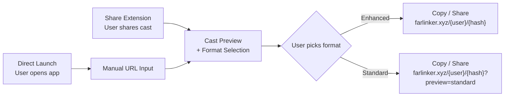
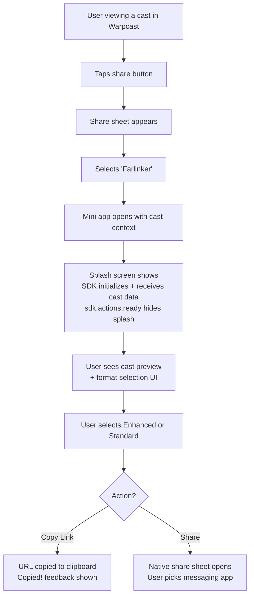
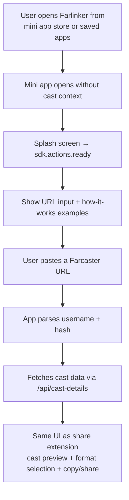
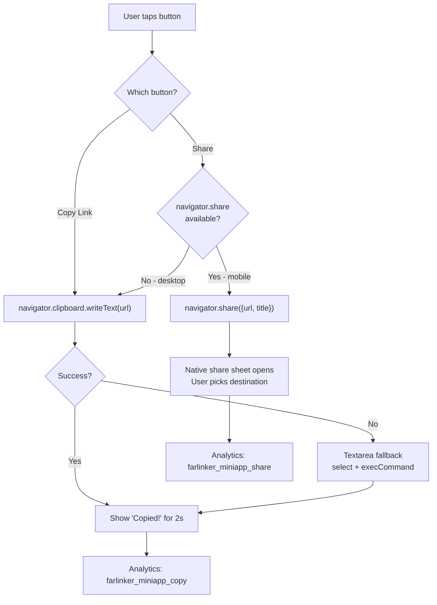

# Mini App User Flows

## Overview

The Farlinker Mini App has two entry points: **share extension** (primary) and **direct launch** (secondary). Both converge on the same format selection and share/copy interface.



---

## Flow 1: Share Extension (Primary)

This is the main use case — a user sees a cast they want to share outside Farcaster with a rich preview.



### Screen Layout (Share Extension)

```
┌─────────────────────────────────┐
│ Cast preview (PFP + name + text)│
├─────────────────────────────────┤
│ ┌─────────┐  ┌─────────┐       │
│ │Enhanced │  │Standard │       │
│ │ preview │  │ preview │       │
│ │ example │  │ example │       │
│ └─────────┘  └─────────┘       │
├─────────────────────────────────┤
│ Generated URL                   │
│ [Copy Link]  [Share]            │
└─────────────────────────────────┘
```

### Key Decisions at Each Step

| Step | User Decision | System Response |
|------|---------------|-----------------|
| 3 | Picks Farlinker from share sheet | Opens mini app with `cast_share` context |
| 6 | Picks Enhanced or Standard | URL toggles `?preview=standard` param |
| 7 | Copy vs Share | Clipboard API vs `navigator.share()` |

---

## Flow 2: Direct Launch (Secondary)

User opens Farlinker directly from the mini app store or saved apps. No cast context is available.



### Screen Layout (Direct Launch)

```
┌─────────────────────────────────┐
│ "Paste a Farcaster URL"         │
│ ┌─────────────────────────────┐ │
│ │ URL input field             │ │
│ └─────────────────────────────┘ │
│ [Generate Link]                 │
├─────────────────────────────────┤
│ How it works:                   │
│ (visual examples of enhanced    │
│  vs standard previews)          │
└─────────────────────────────────┘
```

---

## Flow 3: Format Selection

Applies to both entry points once cast data is available.

### Screen Layout (Format Cards)

```
┌──────────────────┐  ┌──────────────────┐
│   ENHANCED       │  │   STANDARD       │
│                  │  │                  │
│  ┌────────────┐  │  │  ┌────────────┐  │
│  │ Example of │  │  │  │ Example of │  │
│  │ Apple Msgs │  │  │  │ text-based │  │
│  │ rich image │  │  │  │ OG preview │  │
│  │ preview    │  │  │  │            │  │
│  └────────────┘  │  │  └────────────┘  │
│                  │  │                  │
│ Image-based      │  │ Text-based       │
│ preview with     │  │ preview with     │
│ cast content     │  │ title + author   │
│ baked into image │  │ in OG fields     │
└──────────────────┘  └──────────────────┘
        ↕ tap to select ↕

Selected format determines URL:
  Enhanced: farlinker.xyz/username/0xhash
  Standard: farlinker.xyz/username/0xhash?preview=standard
```

### What Each Format Produces

| | Enhanced | Standard |
|---|---------|----------|
| **Apple Messages** | Composite image with PFP, text, embedded images | Title + description text, embedded image or PFP |
| **WhatsApp / Telegram** | Same as standard (platform limitation) | Title + description + image card |
| **Twitter / Discord** | Large image card with all content in image | Standard OG card with title + description |
| **Best for** | Visual impact, Apple Messages | Broad compatibility, all platforms |

---

## Flow 4: Share / Copy Actions



---

## Edge Cases

| Scenario | Handling |
|----------|----------|
| Cast not found (deleted/invalid hash) | Show error message with "try another URL" prompt |
| SDK context unavailable (opened outside Farcaster) | Detect non-Farcaster environment, show manual URL input |
| Cast has no text (image-only cast) | Show image preview, generate URL normally |
| Cast has very long text | Truncate in preview, full text in generated link's OG metadata |
| Network error fetching cast details | Show retry button, cached data if available |
| Clipboard API blocked by browser | Textarea fallback with select + copy instruction |
